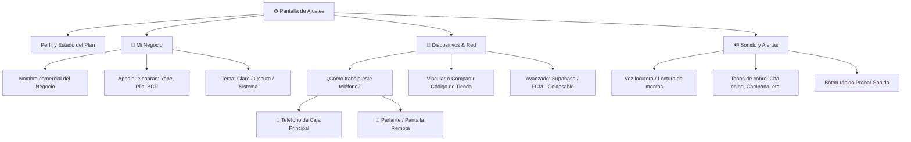

# Propuesta de Rediseño UI / UX: Pantalla de Ajustes (NotiYape)

## 1. Diagnóstico Actual: ¿Por qué se siente desordenado y confuso?

1. **Jerarquía visual plana y elementos estáticos:**
   - La tarjeta de cuenta (`Surface` con el usuario/login) y la fila de 3 pestañas ocupan casi **un tercio vertical de la pantalla** en todo momento de manera fija, reduciendo el espacio útil para configurar.
2. **Confusión entre "Planes" y "Modos de Operación":**
   - Actualmente se mezclan los conceptos de **monetización/suscripción** (*Free vs Premium*) con el **rol técnico del dispositivo** (*Local, Emisor, Receptor*).
   - Para un comerciante o usuario final, preguntarle si es "Emisor" o "Receptor" de entrada resulta técnico. Lo que el usuario realmente quiere es: *"¿Este teléfono cobra o este teléfono solo escucha a distancia?"*.
3. **Sobrecarga de información en pestañas:**
   - Hay botones para guardar dispersos por todos lados (*"Aplicar Modo Seleccionado"*, *"Guardar Nombre"*, *"Guardar Voz"*, etc.).
   - La pantalla mezcla configuraciones del negocio, credenciales técnicas de Supabase, interruptores de voz, pruebas de conexión y tokens en una sola vista con mucho scroll.

---

## 2. Nueva Arquitectura de Información (UX Recomendado)

Siguiendo las mejores prácticas de **Material You (Material 3)** y apps financieras modernas (como Revolut, Mercado Pago o Clover), los ajustes se dividen de manera natural en **3 áreas funcionales intuitivas**:

---

## 3. Detalle de Mejoras por Sección

### A. Cabecera Unificada: Cuenta + Tienda (Header Limpio)
* **Antes:** Una tarjeta grande con nombre, email, whatsapp, botón salir, etc., ocupando mucho espacio.
* **Nueva Propuesta:**
  - Un encabezado compacto estilo perfil moderno:
    - Avatar/Inicial con borde de color del estado (`Verde = Conectado`).
    - Nombre del usuario y Chip elegante del Plan (`GRATIS` o `PREMIUM`).
    - Un botón de acción rápido: Icono de `Cerrar sesión` o `Ingresar`.
  - Al presionar la tarjeta de perfil, se abre un modal de detalles (evitando saturar la pantalla principal).

### B. Pestaña 1: "🏪 Negocio" (Lo esencial para el día a día)
Esta pestaña responde a: *¿Cómo se llama mi tienda y qué pagos reconozco?*
1. **Identidad del Comercio:**
   - Campo para el Nombre del Negocio (se autoguarda con foco o con botón minimalista integrado en el input).
2. **Filtro de Aplicaciones:**
   - Interruptores claros con iconos oficiales:
     - 🟣 **Yape** (Activado por defecto)
     - 🔵 **BCP**
     - 🟢 **Plin**
3. **Apariencia:**
   - Selector segmentado de 3 botones: `Sistema | Claro | Oscuro`.

### C. Pestaña 2: "📡 Dispositivos" (Adiós a la confusión de "Modos y Planes")
En lugar de presentar 3 cajas grandes confusas con terminología técnica:
1. **Selector de Función del Teléfono (Segmented Card Selector):**
   - **Opción 1: 📱 "Caja Principal (Cobra en este teléfono)"**
     - Subtexto: *Captura los pagos de Yape y los canta de inmediato.*
     - Muestra automáticamente: Botón *"🔗 Vincular otro teléfono o parlante"* que genera el código temporal de 6 dígitos.
   - **Opción 2: 📢 "Receptor / Parlante (Monitorea a distancia)"**
     - Subtexto: *No cobra directamente; recibe las alertas que le envían desde caja.*
     - Muestra automáticamente: Campo para ingresar el código de 6 dígitos o escanear QR.
2. **Sección "Avanzado / Nube" (Colapsable / Accordion):**
   - Los datos técnicos (URL de Supabase, llaves de API, test FCM) se ocultan dentro de una pestaña desplegable *"Configuración de Servidor (Avanzado)"* para no asustar al usuario común.

### D. Pestaña 3: "🔊 Sonido & Voz"
1. **Interruptor Maestro:**
   - Switch principal: *"Locutor de Pagos (Voz que canta montos)"*.
2. **Plantilla de Voz:**
   - Ejemplos interactivos predefinidos:
     - *"Pago en tienda: {monto} soles de {emisor}"*
     - *"Recibiste {monto} soles"*
     - *"Yape recibido de {emisor}"*
3. **Tono de Notificación:**
   - Menú selector de sonidos (Cha-Ching, Campana, Monedas) con un botón play ▶️ al lado para preescuchar al instante.
4. **Volumen y Vibración:**
   - Slider de volumen y switch de vibración háptica.

---

## 4. Principios de UI/UX a Aplicar

| Problema Actual | Solución UI/UX | Beneficio |
| :--- | :--- | :--- |
| **Botones "Guardar" duplicados** | Auto-guardado en tiempo real al cambiar switches o campos (`onValueChange`) | Cero fricción para el usuario. |
| **Pestañas estáticas pesadas** | Pestañas tipo `PrimaryTabRow` fluidas con animación de deslizamiento | Ahorro de 60dp de altura vertical. |
| **Terminología técnica (SENDER / RECEIVER)** | Lenguaje amigable: *"Caja Principal"* y *"Parlante a Distancia"* | Cualquier persona lo entiende sin manual. |
| **Credenciales expuestas** | Acordeón colapsable con candado `Avanzado` | Protege contra errores y limpia la vista. |
